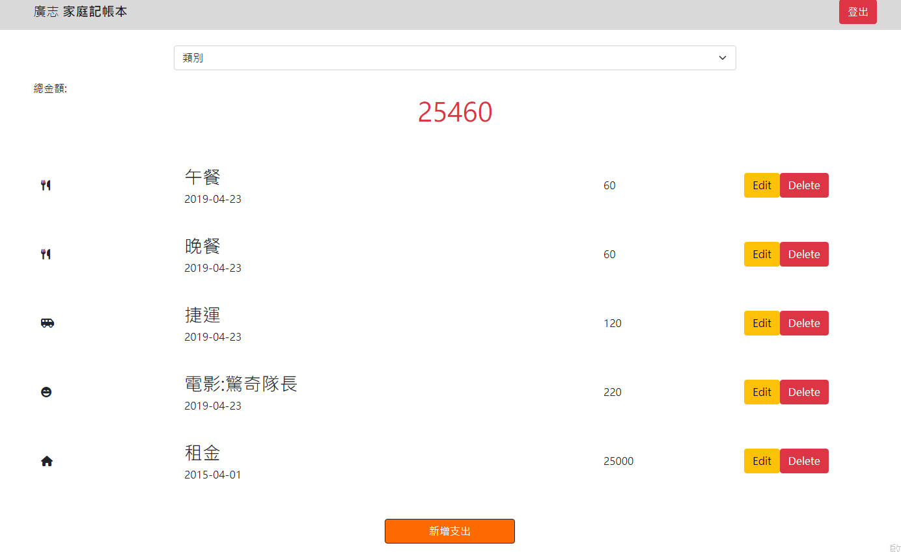

# 記帳程式



## 介紹

拔拔的私房錢

若有使用Seed，提供兩組試用帳號

1. user1@example.com / 12345678
2. user2@example.com / 12345678

## 功能
- 新增費用
- 查詢特定種類之項目
- 編輯費用
- 刪除餐廳
- 登入使用者
- 創建使用者

## 使用須知

1. 終端機需安裝 Node.js & npm 
2. clone專案至本地
3. 專案開啟後於，需於終端機輸入以下指令，輸入完後，安裝package.json
```bash
npm install
```
4. npm安裝完成後若有需要腳本資料，請於終端機輸入以下指令
```bash
npm run seed
```
5. 若需要將程式啟動，請於終端機輸入以下指令
```bash
 npm run start
```
6. 看見以下訊息，表示順利運行，在瀏覽器輸入: localhost:3000 進入 

```bash
Restaurant is running on localhost:3000 
```

7. 若要退出
```bash
ctrl + c 
```

## 使用工具
- "Node.js": "16.14.0"
- "bcryptjs": "^2.4.3"
- "connect-flash": "^0.1.1"
- "dotenv": "^8.2.0"
- "express": "^4.17.3"
- "express-handlebars": "^4.0.2"
- "express-session": "^1.17.1"
- "method-override": "^3.0.0"
- "Bootstrap": "5.1.3"
- "MongoDB"
- "mongoose": "^5.13.14"
- "passport": "^0.4.1",
- "passport-facebook": "^3.0.0"
- "passport-local": "^1.0.0"
